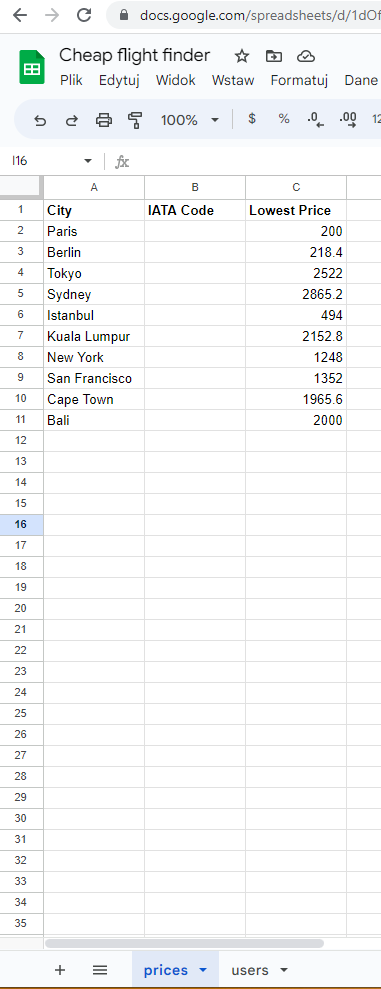
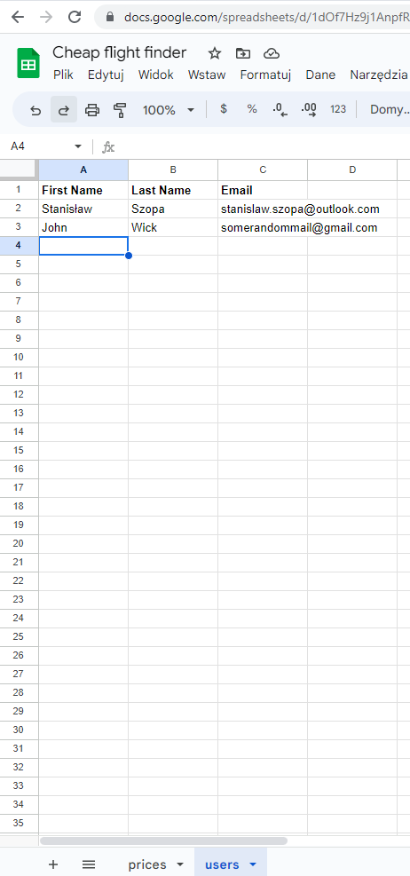
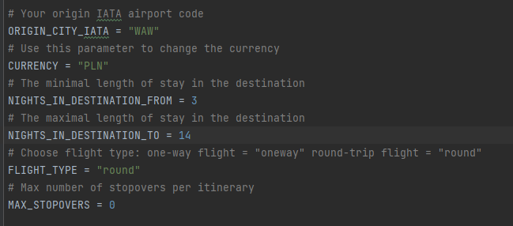

# Cheap flight finder
> Cheap flight finder using kiwi.com tequila API

## Table of Contents
* [General Info](#general-information)
* [Technologies Used](#technologies-used)
* [Features](#features)
* [Setup](#setup)
* [Usage](#usage)
* [Project Status](#project-status)
* [Contact](#contact)

## General Information
I always loved to travel but flights can be quite expensive and searching everyday for cheap flights can be time consuming so I created finder for cheap flights using kiwi.com tequila API to automate this process and notify me with amazing deals.

## Technologies Used
- Python

## Features
List the ready features here:
- SMS notifciation using twilio
- Email notification
- Adding new users to email notifcations

## Setup
Requirements:  
Setup below API credentials and add them as environment variables  
go to https://www.twilio.com/en-us to register and get:
- TWILIO_SID = os.environ['TWILIO_ACCOUNT_SID']
- TWILIO_AUTH_TOKEN = os.environ['TWILIO_AUTH_TOKEN']
- TWILIO_VIRTUAL_NUMBER = os.environ['TWILIO_SEND_NUMBER']
- TWILIO_VERIFIED_NUMBER = os.environ['TWILIO_AUTH_NUMBER']

go to https://dashboard.sheety.co/login to register and get:
- SHEETY_PRICES_ENDPOINT = os.environ['SHEETY_PRICES']
- SHEETY_USERS_ENDPOINT = os.environ['SHEETY_USERS']

if you enabled token authentication also this:
- SHEETY_TOKEN = os.environ['SHEETY_TOKEN']

go to https://tequila.kiwi.com/portal/login to register and get:
- TEQUILA_API_KEY = os.environ['KIWI_API_KEY']

setup your email account to use with smtplib
- Gmail: smtp.gmail.com
- Hotmail: smtp.live.com
- Outlook: outlook.office365.com
- Yahoo: smtp.mail.yahoo.com

Make sure you've enabled less secure apps if you are sending from a Gmail account.
- MAIL_PROVIDER_SMTP_ADDRESS = "smtp.gmail.com"
- MY_EMAIL = os.environ['MY_EMAIL']
- MY_PASSWORD = os.environ['MY_PASSWORD']

prices table should look like this with GET,PUT methods enabled on sheety, IATA code column will fill automaticly to typed cities in City column  
  
users table should look like this with GET,POST methods enabled on sheety  
  

## Usage
Change parameters at the top of main.py to yours and run  
  
If you want to add new user to email notifications run add_user.py, you can also host it for example on replit and share it to others so they can add themselfs.

## Project Status
Project is: complete

## Contact
My [Linkedin](https://www.linkedin.com/in/stanislawszopa/) - feel free to contact me!
